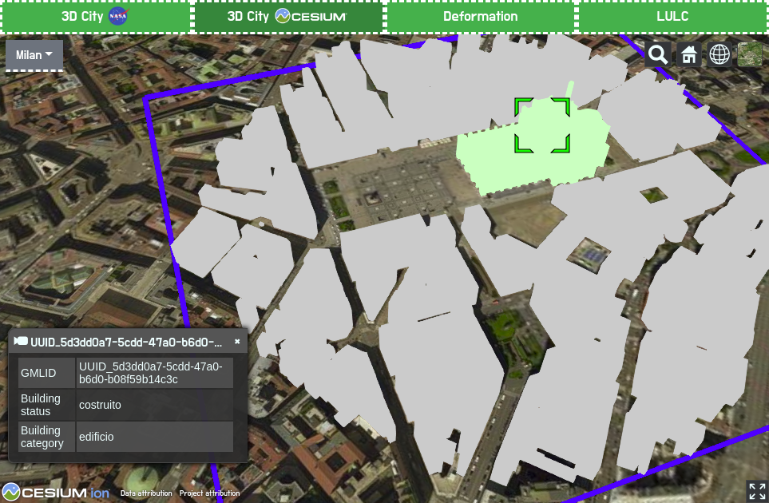
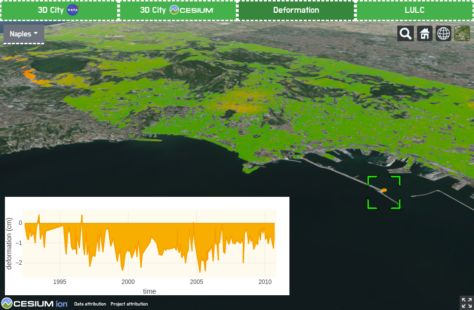
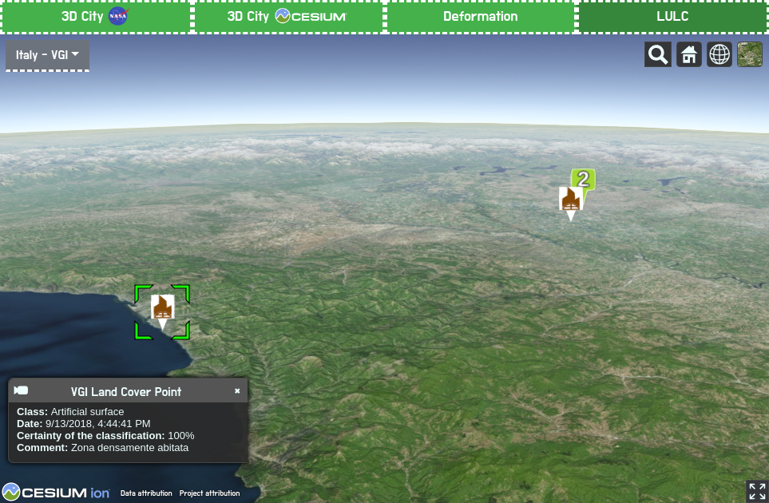

# URBAN GEO BIG DATA

The project encompasses visualization of various use cases related to urban areas. The visualization is performed by means of a 3D Web GIS. Through effective visualization, this project aims to communicate data in a clear way. The data that is visualized is generated within the <a href="http://www.urbangeobigdata.it/">URBAN GEOmatics for Bulk data Generation, Data Assessment and Technology Awareness (URBAN GEO BIG DATA)</a> project. Besides visualization, data used in some of the use cases can be queried and analyzed. This project also aims to address the challenge of visualization and analysis of big raster geospatial data with time dimension. This is a work in progress.

The libraries used to visualize and query geospatial data on virtual globes on Web are <a href="https://worldwind.arc.nasa.gov/web/">NASA Web WorldWind</a> and <a href="https://cesiumjs.org/">Cesium</a>. The analysis will be enabled through <a href="https://github.com/dioptre/rasdaman">rasdaman</a> Web Processing Service (WPS).

Below the use cases are explained.  

## OpenStreetMap (OSM) buildings visualization

3D OSM buildings visualization on NASA Web WorldWind virtual globe has been performed using <a href="https://github.com/kilsedar/3dosm">3dosm</a>.

Milan building heights are set using LiDAR and OSM GeoJSON in GRASS GIS.

Rome building heights are obtained using the <a href="https://land.copernicus.eu/local/urban-atlas/building-height-2012?tab=download">Urban Atlas - Building Height 2012</a> data of the Copernicus programme and OSM GeoJSON in GRASS GIS.

Naples, Turin and Padua building heights come from OSM database.

## CityGML data visualization and query

CityGML data visualization on Cesium virtual globe has been performed using <a href="https://github.com/3dcitydb/3dcitydb-web-map">3DCityDB-Web-Map-Client</a>. Each building can be queried.

## Deformation visualization and query

The deformation map of Naples has been produced using multi-temporal differential synthetic aperture radar interferometry (DInSAR) technique, referred as Small BAseline Subset (SBAS) by <a href="https://www.cnr.it/en">National Research Council of Italy</a> (Consiglio Nazionale delle Ricerche, CNR) - <a href="http://www.irea.cnr.it/en/">Institute for Electromagnetic Sensing of the Environment</a> (Istituto per il Rilevamento Elettromagnetico dell’Ambiente, IREA). The technique, which was proposed in 2002, is widely used for the investigation of Earth surface deformation, and allows the generation of mean deformation velocity maps, and for each target on the ground deformation time series. The dataset used consists of 164 SAR images collected by the ERS and the Envisat satellites. The data is stored on <a href="https://github.com/geoserver/geoserver">GeoServer</a> and used as a Web Map Service (WMS) image layer on Cesium virtual globe. Each target on the ground can be queried to display the deformation time series plot.

## Volunteered geographic information (VGI) land cover visualization and query

The VGI land cover data is collected using <a href="https://github.com/kilsedar/land-cover-collector">Land Cover Collector</a> application and visualized on Cesium virtual globe. Each land cover point can be queried. The points of same class are aggregated after a certain zoom level.

## Acknowledgments
URBAN GEO BIG DATA is a <a href="http://prin.miur.it/">Project of National Interest (PRIN)</a>, funded by the <a href="http://www.miur.gov.it/web/guest/home">Italian Ministry of Education, University and Research (MIUR)</a> – id. 20159CNLW8.
