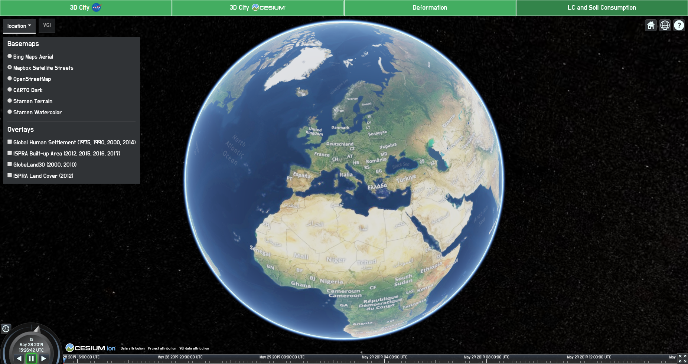
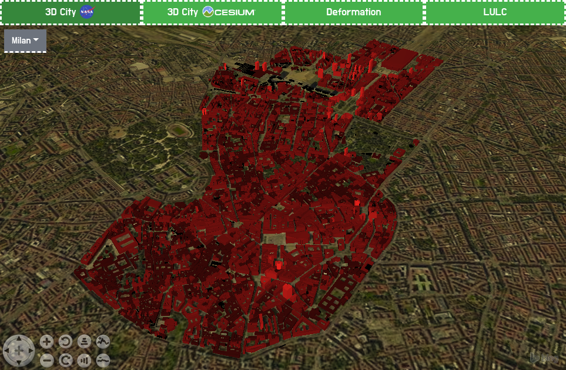
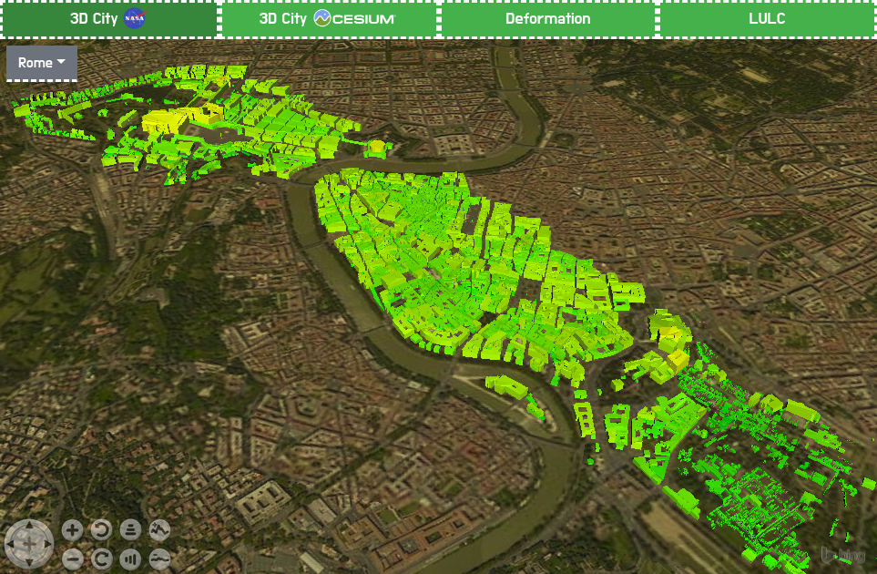
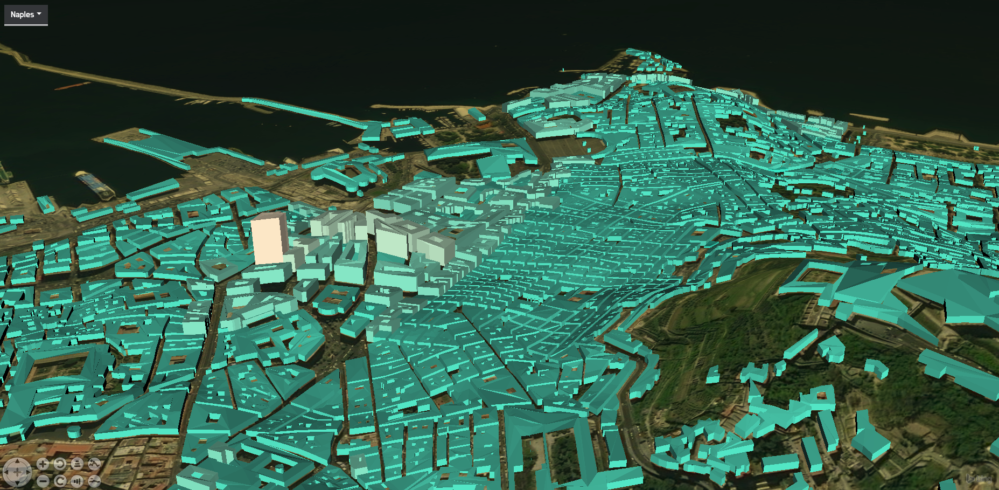
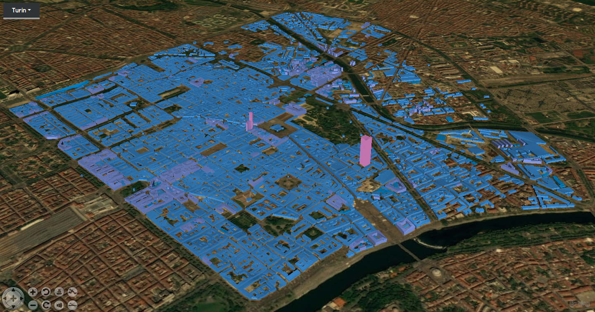
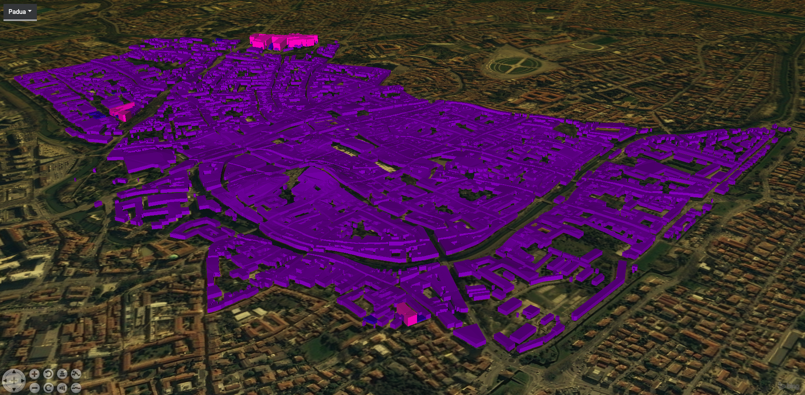
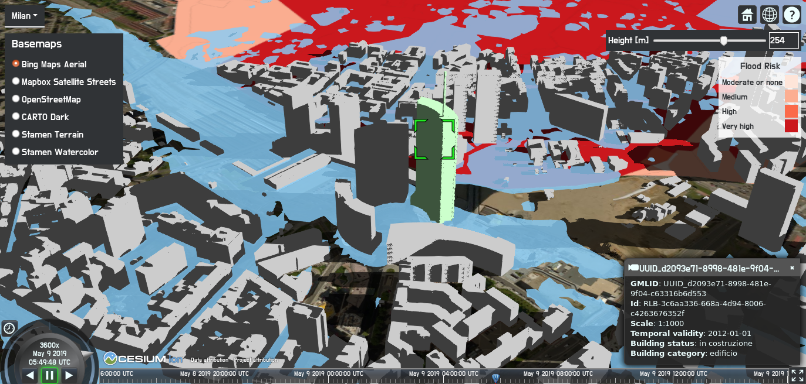
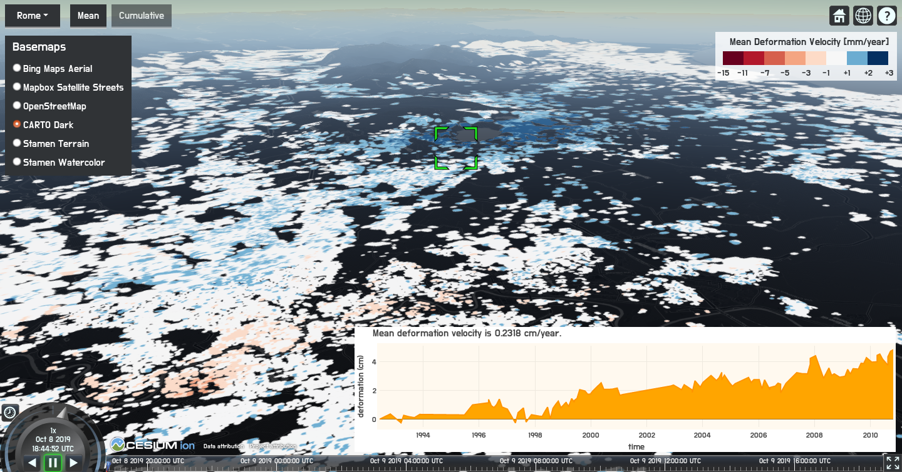
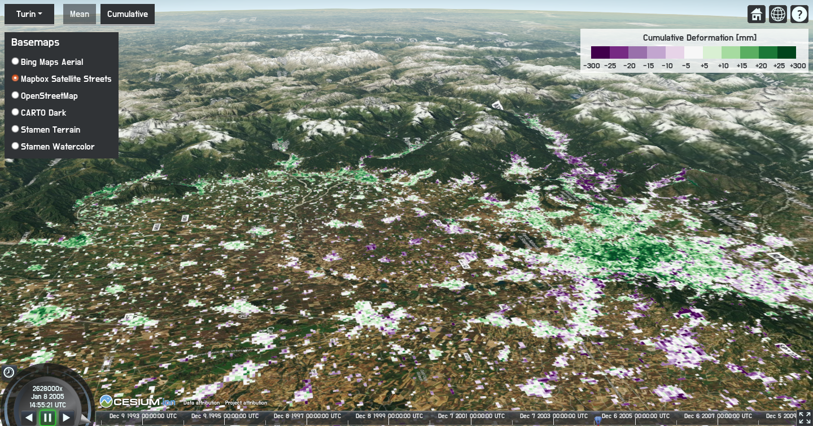
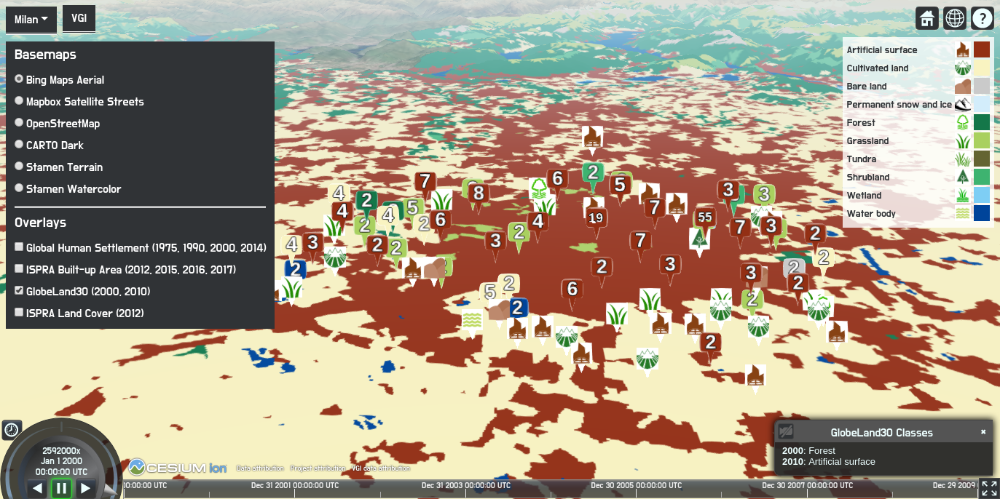

# URBAN GEO BIG DATA

The project encompasses visualization of various use cases related to urban areas. The visualization is performed by means of a 3D Web GIS. Through effective visualization, this project aims to communicate data in a clear way. The data that is visualized is generated within the <a href="http://www.urbangeobigdata.it/">URBAN GEOmatics for Bulk data Generation, Data Assessment and Technology Awareness (URBAN GEO BIG DATA)</a> project. Besides visualization, data used in some of the use cases can be queried and processed. This project also aims to address the challenge of visualization and processing of big raster geospatial data with a time dimension on the Web.

The libraries used to visualize and query geospatial data on virtual globes on Web are <a href="https://worldwind.arc.nasa.gov/web/">NASA Web WorldWind</a> and <a href="https://cesiumjs.org/">CesiumJS</a>. The processing is enabled through <a href="http://www.rasdaman.org/browser">rasdaman</a> (raster data manager), an Array DBMS.

<i>Interface of the Web GIS where all the use cases can be accessed</i>

Below the use cases are explained.   

## OpenStreetMap (OSM) buildings visualization

3D OSM buildings visualization on NASA Web WorldWind virtual globe has been performed using <a href="https://github.com/kilsedar/3dosm">3dosm</a>.

Milan building heights are set using LiDAR and OSM GeoJSON in GRASS GIS.

<i>3D visualization of OSM buildings in Milan</i>

Rome building heights are obtained using the <a href="https://land.copernicus.eu/local/urban-atlas/building-height-2012?tab=download">Urban Atlas, Building Height 2012</a> raster data of the Copernicus programme and OSM GeoJSON in GRASS GIS.

<i>3D visualization of OSM buildings in Rome</i>

Naples, Turin and Padua building heights come from OSM database.

<i>3D visualization of OSM buildings in Naples</i>

<i>3D visualization of OSM buildings in Turin</i>

<i>3D visualization of OSM buildings in Padua</i>

## CityGML data visualization and query

CityGML data visualization on CesiumJS virtual globe has been performed using <a href="https://github.com/3dcitydb/3dcitydb">3DCityDB</a>, <a href="https://github.com/3dcitydb/importer-exporter">3DCityDB Importer/Exporter</a>, and <a href="https://github.com/3dcitydb/3dcitydb-web-map">3DCityDB-Web-Map-Client</a>. Each building can be queried. Moreover, flooding is simulated to aid in the informed decision-making process regarding adaptation measures and mitigation of flooding effects.

<i>Flood simulation in Milan with CityGML visualization and query</i>

## Deformation visualization and query

The deformation maps are produced by <a href="https://www.cnr.it/en">National Research Council of Italy</a> (Consiglio Nazionale delle Ricerche, CNR), <a href="http://www.irea.cnr.it/en/">Institute for Electromagnetic Sensing of the Environment</a> (Istituto per il Rilevamento Elettromagnetico dell'Ambiente, IREA). The technique, which was proposed in 2002, is widely used for the investigation of Earth surface deformation and allows the generation of mean deformation velocity maps, and for each target on the ground deformation time series. The dataset used consists of 164 SAR images collected by the ERS and the Envisat satellites.

Data is stored on <a href="https://github.com/geoserver/geoserver">GeoServer</a> and used through Web Map Service (WMS) on a virtual globe built with CesiumJS. Each target on the ground can be queried to display the deformation time series plot. Time series are plotted using Plotly.js. Deformation is also visualized for 18 years as animation using Web Map Tile Service (WMTS) and ImageMosaic through GeoServer and timeline and animation widgets of CesiumJS to demonstrate the movement of the land for Naples, Milan, and Turin. The same will be implemented also for Rome and Padua.

<i>Mean deformation velocity visualization and query</i>

<i>A raster layer of cumulative deformation animation</i>

## Big multidimensional raster data visualization and processing

EO-derived datasets GlobeLand30 of 2000 and 2010; Global Human Settlement Layer of 1975, 1990, 2000 and 2014; built-up area map from ISPRA (Italian Institute for Environmental Protection and Research) of 2012, 2015, 2016 and 2017; land cover map from ISPRA of 2012 are visualized and processed on the Web. The spatial extent of all the datasets is restricted to Italy because of the limited hardware. The spatial resolutions of the datasets in order are 30 m, 40 m, 10 m, and 10 m.

The datasets of multiple years are visualized using animation to enable detecting changes in land cover or soil consumption visually using the same method for deformation animation. The datasets are processed using Web Coverage Processing Service (WCPS) through rasdaman. At the moment, the processing involves returning the change of land cover classes or soil consumption through years for the clicked coordinates. In the future, the amount of change of a land cover class or soil consumption will be calculated for an area drawn by the user for two selected years.

## VGI visualization and query

Volunteered geographic information (VGI) on land cover classification, collected with the application <a href="https://github.com/kilsedar/land-cover-collector">Land Cover Collector</a>, using the nomenclature of GlobeLand30 is overlaid on top of the raster maps of land cover and soil consumption. The VGI data can be queried.

<i>VGI and GlobeLand30 visualization and processing</i>

## Acknowledgments
URBAN GEO BIG DATA is a <a href="http://prin.miur.it/">project of national interest (PRIN)</a>, funded by the <a href="http://www.miur.gov.it/web/guest/home">Italian Ministry of Education, University and Research (MIUR)</a>―id 20159CNLW8.
