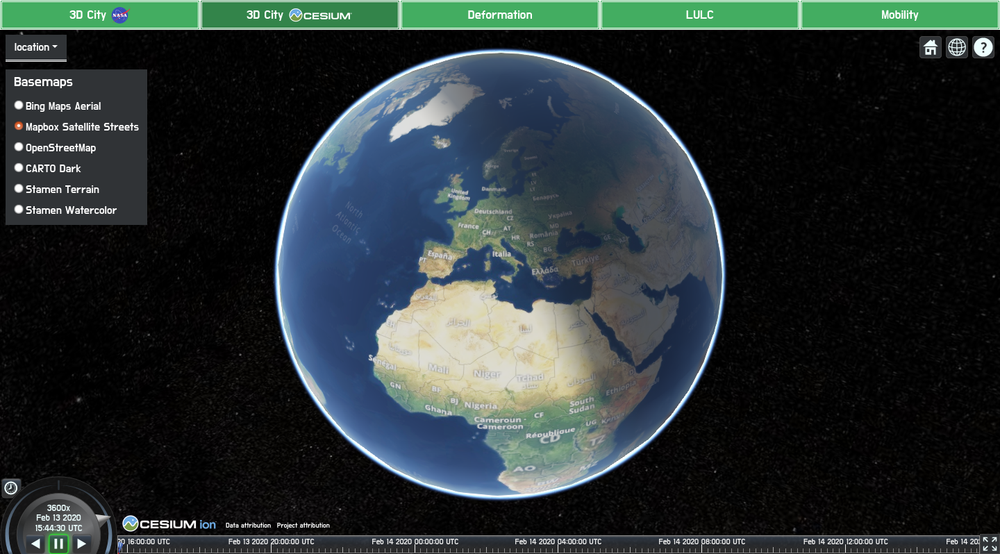
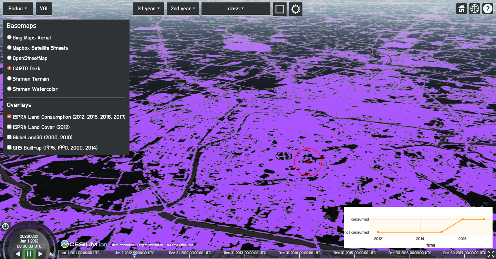
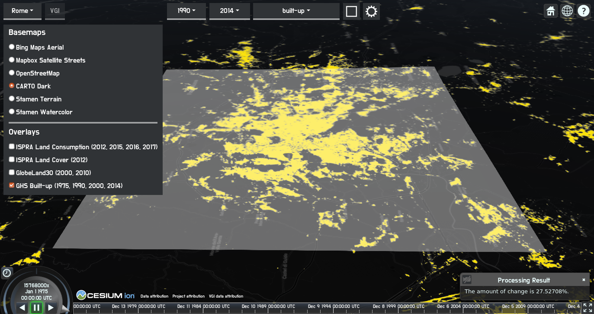
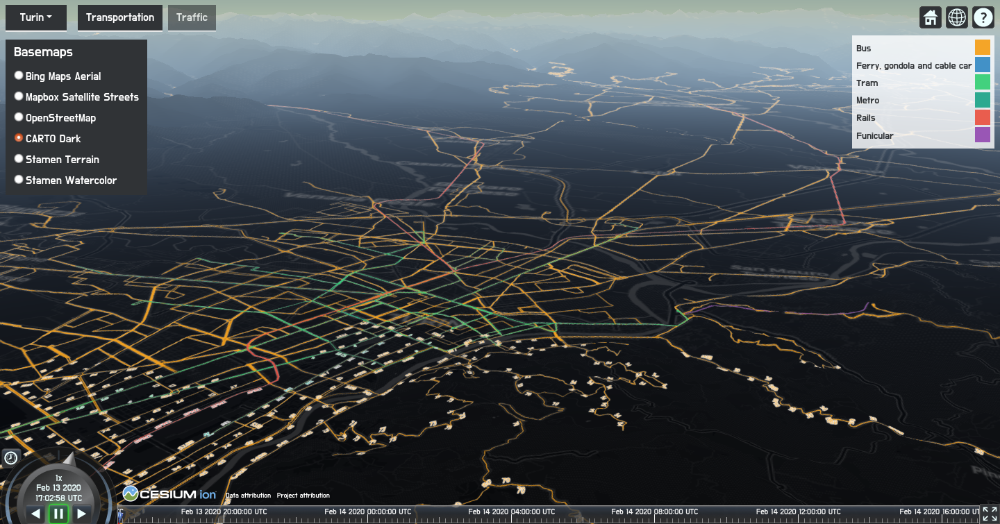
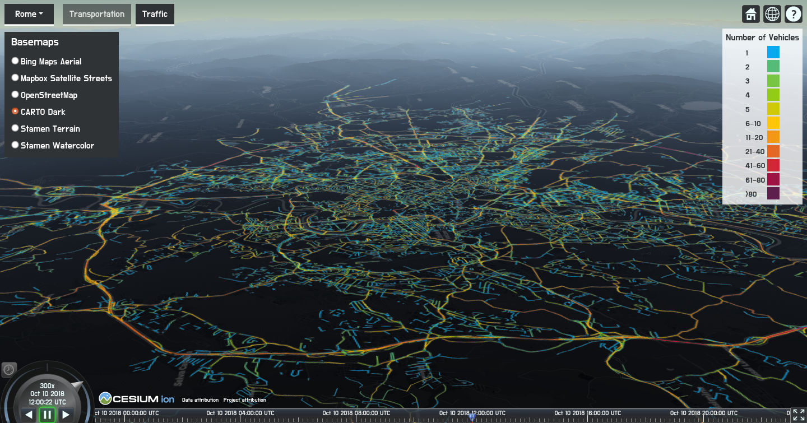

# URBAN GEO BIG DATA

The geoportal of the <a href="http://www.urbangeobigdata.it/">URBAN GEOmatics for Bulk data Generation, Data Assessment and Technology Awareness (URBAN GEO BIG DATA)</a> project is composed of five virtual globes that represent five applications. NASA Web WorldWind and CesiumJS APIs were utilized for creating the virtual globes. The applications enable the visualization, query and processing of multidimensional vector and raster geospatial data related to urban areas on the Web. The urban areas that the project has focused on are Milan, Padua, Rome, Naples and Turin in Italy.

<i>GUI of the geoportal through which all the applications can be accessed</i>

Below the applications are explained.  

## OpenStreetMap (OSM) data visualization

OSM data, specifically building footprints, were utilized for 3D visualization of buildings using NASA Web WorldWind API and <a href="https://github.com/kilsedar/3dosm">3dosm</a> plugin API.

Milan building heights were set using LiDAR and OSM GeoJSON data in GRASS GIS.

<i>3D visualization of OSM buildings in Milan</i>

Rome building heights were obtained using the <a href="https://land.copernicus.eu/local/urban-atlas/building-height-2012?tab=download">Urban Atlas, Building Height 2012</a> raster data of the Copernicus programme and OSM GeoJSON data in GRASS GIS.

<i>3D visualization of OSM buildings in Rome</i>

Naples, Turin and Padua building heights came from OSM database.

<i>3D visualization of OSM buildings in Naples</i>

<i>3D visualization of OSM buildings in Turin</i>

<i>3D visualization of OSM buildings in Padua</i>

## CityGML data visualization

CityGML data visualization on a virtual globe created using CesiumJS API was performed utilizing <a href="https://github.com/3dcitydb/3dcitydb">3DCityDB</a>, <a href="https://github.com/3dcitydb/importer-exporter">3DCityDB Importer/Exporter</a> and <a href="https://github.com/3dcitydb/3dcitydb-web-map">3DCityDB-Web-Map-Client</a>. Moreover, flooding can be simulated to aid in the informed decision-making processes regarding adopting adaptation measures and mitigating flooding effects. A relevant publication is available <a href="https://www.int-arch-photogramm-remote-sens-spatial-inf-sci.net/XLII-2-W11/669/2019/">here</a>.

<i>Flood simulation in Milan with CityGML data visualization</i>

## Ground deformation visualization and query

The ground deformation data were produced by <a href="https://www.cnr.it/en">National Research Council of Italy</a> (Consiglio Nazionale delle Ricerche, CNR), <a href="http://www.irea.cnr.it/en/">Institute for Electromagnetic Sensing of the Environment</a> (Istituto per il Rilevamento Elettromagnetico dell'Ambiente, IREA). The technique is widely used for the investigation of deformation and allows the generation of mean deformation velocity maps and deformation time series for each target on the ground.

The data were stored on GeoServer. The mean deformation velocity maps were visualized through Web Map Service (WMS) on a virtual globe created using CesiumJS API. Each target on the ground can be queried. Each query invokes a Web Feature Service (WFS) request to get the deformation time series that were plotted using Plotly.js. Deformation was visualized also as an animation for each city that displays the deformation of 18 years using ImageMosaic data source of GeoServer, Web Map Tile Service (WMTS) and timeline and animation widgets of CesiumJS API. A relevant publication is available <a href="https://www.int-arch-photogramm-remote-sens-spatial-inf-sci.net/XLII-4-W14/135/2019/">here</a>.

<i>Visualization of mean deformation velocity map of Rome and plot of deformation time series</i>

<i>Visualization of a raster layer of the deformation animation of Turin</i>

## Land use and land cover visualization, query and processing

EO-derived datasets (land consumption maps from ISPRA (Italian Institute for Environmental Protection and Research) of 2012, 2015, 2016 and 2017; land cover map from ISPRA of 2012; GlobeLand30 of 2000 and 2010; and GHS-BUILT of 1975, 1990, 2000 and 2014) were visualized and can be processed using the geoportal.

The datasets of multiple years were visualized as an animation with the same method used for deformation animation. The datasets can be processed using Web Coverage Processing Service (WCPS) through rasdaman. The processing involves returning the change of land use or land cover classes for the clicked coordinates. Moreover, the amount of change of a land use or land cover class can be calculated for an area drawn by the user for two selected years.

<i>Processing executed for a set of coordinates that returns the land consumption state for the years that the land consumption maps from ISPRA are available</i>

<i>Processing executed for an area that calculates the amount of change of built-up areas from 1990 to 2014 according to GHS-BUILT dataset</i>

Additionally, Volunteered Geographic Information (VGI) on land cover classification, collected with the <a href="https://github.com/kilsedar/land-cover-collector">Land Cover Collector</a> application that uses the nomenclature of GlobeLand30 can be placed on top of the raster maps of land use and land cover. The VGI can be queried.

<i>Clusters of VGI and query of a VGI point</i>

## Mobility visualization

Public transportation networks were visualized using WMS. Moreover, traffic (i.e., number of vehicles) for each of 24 hours of a day (October 10, 2018) was visualized as an animation using WMS and timeline and animation widgets of CesiumJS API.

<i>Visualization of the public transportation network of Turin</i>

<i>Visualization of traffic in Rome between 12:00 and 13:00 UTC</i>

## Acknowledgments
URBAN GEO BIG DATA is a <a href="http://prin.miur.it/">Project of National Interest (PRIN)</a>, funded by the <a href="http://www.miur.gov.it/web/guest/home">Italian Ministry of Education, University and Research (MIUR)</a>―id 20159CNLW8.
